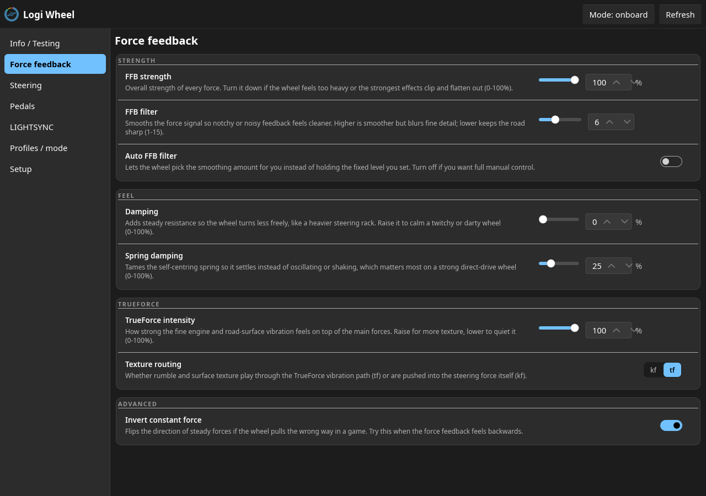
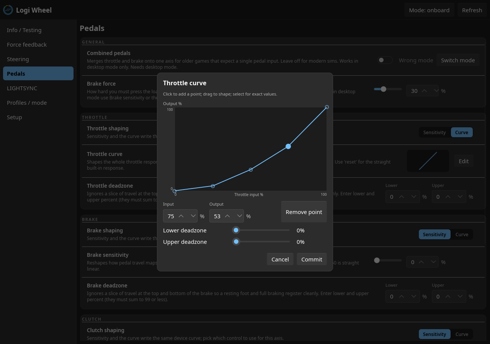
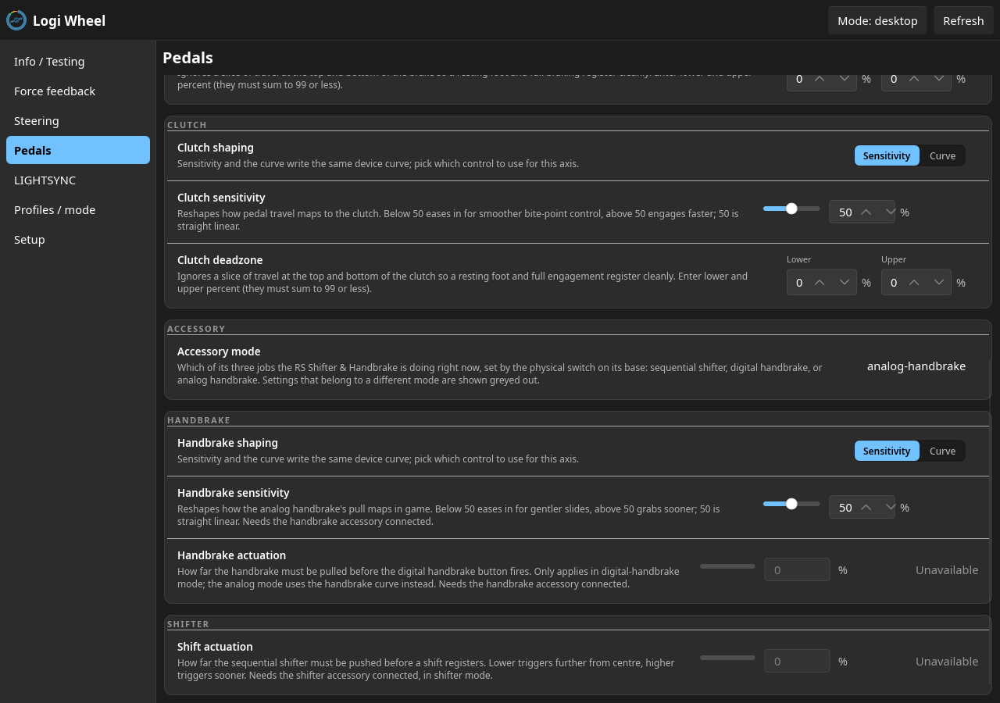
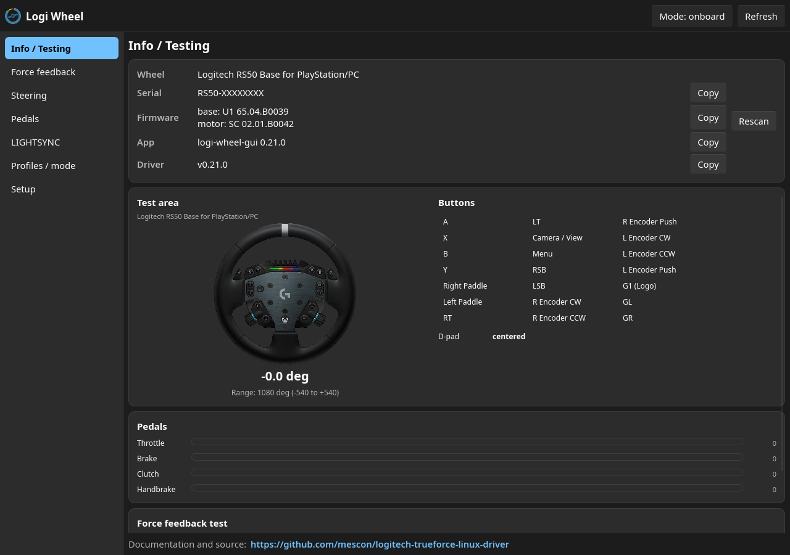
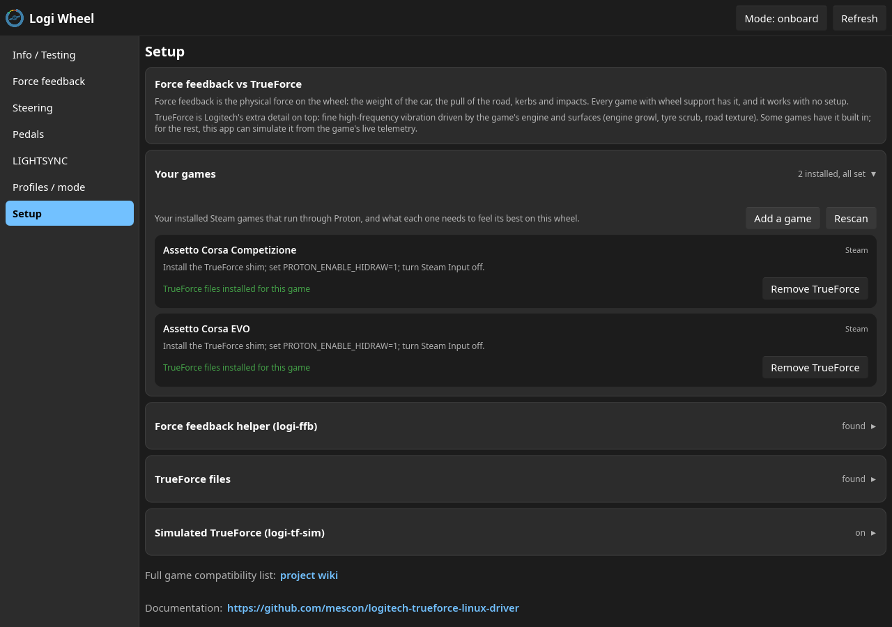

# Logitech TrueForce Linux Driver

A Linux kernel driver and userspace tools for three Logitech racing wheels:
the direct-drive **RS50** and **G PRO Racing Wheel**, and the belt-driven
**G923**. It brings force feedback, TrueForce haptics, a live RPM rev-light
display, LIGHTSYNC LED control, and G HUB-equivalent wheel settings to Linux,
including in Proton/Wine sims.

**This is the first TrueForce implementation on Linux.** TrueForce is
Logitech's high-frequency haptic layer - engine note, road surface and tyre
texture felt through the rim, on top of ordinary force feedback - and until
this project it did not exist here at all. It arrives two ways:

- **Native**, in sims that support Logitech's SDK. The haptics are the
  game's own TrueForce signal, carried to the wheel unchanged: what you feel
  is what the developers authored, not an approximation of it.
- **Simulated**, in everything else. Where a game has no TrueForce,
  `logi-tf-sim` synthesises it from that game's live telemetry - engine RPM,
  speed, surface - so wheels still get texture in titles that never shipped
  support for it.

The **G923** matters as much here as the direct-drive wheels. It is the only
Linux driver that gives it TrueForce, and the only one that gives the
PlayStation edition force feedback at all - that edition had none on Linux
before this. See [G923 support](#g923-support).

> The older **G920** is already served by the in-tree `hid-logitech-hidpp`
> driver and does not need this one.

## Logi Wheel

**Logi Wheel** is how you drive all of this. It is this project's answer to G
HUB, and it is where you will spend your time: every setting the wheel
supports, in one place, with the ones your hardware or current mode cannot
accept greyed out and labelled with the reason rather than silently failing.
It runs as a desktop app (`logi-wheel-gui`) or in a terminal (`logi-wheel`),
and both are built from the same core, so they offer the same settings and
the same validation.



Beyond the settings, it has a G HUB-style curve editor for the pedals, a
LIGHTSYNC editor whose changes reach the wheel as you make them, a Setup page
that finds your sims across Steam, Lutris and Heroic and turns the per-game
TrueForce helpers on and off, and an Info / Testing page with live input and
cancelable force tests.

## What works

Force feedback, TrueForce haptics, LEDs, pedals, the RS Shifter & Handbrake, and
the full set of G HUB wheel settings all work. The RS50 is the development
hardware and is verified directly; the G PRO runs the same code path and is
expected to work, with a few items awaiting an owner's confirmation.

**Legend:** ✅ verified on hardware · 🟢 shares the verified code path, expected
to work · 🟡 needs a tester · `-` not applicable.

| Capability | RS50 | G PRO |
|---|:--:|:--:|
| Steering, pedals, buttons, D-pad | ✅ | 🟢 |
| Force feedback (full evdev effect suite) | ✅ | 🟢 |
| Force feedback in DirectInput sims (via `logi-ffb`) | 🟡 | 🟡 |
| TrueForce haptics (Proton + Logitech's signed SDK) | ✅ | 🟢 |
| Rotation range (90 to 2700°), strength, damping, filters | ✅ | 🟢 |
| Pedal response curves, sensitivity, deadzones, combined pedals | ✅ | 🟢 |
| RS Shifter & Handbrake (shift, digital + analog handbrake) | ✅ | 🟢 |
| LIGHTSYNC RGB LEDs (slots, colors, direction; edits apply live) | ✅ (faceplate strip) | 🟡 (rev lights) |
| RPM rev-light display (level fill, direction-aware) | ✅ | 🟡 |
| Simulated TrueForce from game telemetry (`logi-tf-sim`) | ✅ (sweep-verified) | 🟢 |
| Centre calibration, mode / profile switching, computer-side profiles | ✅ | 🟢 |

USB IDs covered: RS50 (`046d:c276` native, `046d:c272` compatibility mode),
G PRO Racing Wheel (`046d:c272` Xbox/PC, `046d:c268` PS/PC), and the G923
(`046d:c266`/`c267` PlayStation edition, `046d:c26d`/`c26e` Xbox edition -
see [G923 support](#g923-support)).

## What's included

Everything below is built from this repository:

- **The kernel driver** (`hid-logitech-dd`) makes the wheel work: games get
  standard Linux force feedback, and every wheel setting appears under
  `/sys/.../wheel_*`. Your other Logitech devices stay on their usual drivers.
  It drives the G923 too, through a separate force-feedback engine suited to
  that wheel (see [G923 support](#g923-support)).

- **Logi Wheel**, described [above](#logi-wheel), is the app you configure the
  wheel with. `logi-wheel-gui` is the desktop version, with a LIGHTSYNC editor
  whose per-slot colors and animation direction reach the wheel immediately,
  computer-side profile presets, a Setup page for your sims, and an Info /
  Testing page with a rotating wheel diagram, button and pedal readouts and
  cancelable force tests. `logi-wheel` is the terminal version: the same
  settings and the same G HUB-style curve editor, so you never have to `echo`
  values into sysfs by hand.

- **logi-ffb** restores force feedback in DirectInput sims under Wine/Proton
  (Le Mans Ultimate, for example). One launch option and it works: see
  [Force feedback in games](#force-feedback-in-games).

- **logi-tf-sim** gives you TrueForce engine haptics and a live RPM rev-light
  display in games with no native TrueForce, using the game's own UDP
  telemetry. Supported games are auto-detected (DiRT Rally 2.0 and the classic
  Codemasters format, Automobilista 2 / Project CARS 2, F1, BeamNG.drive and
  EA Sports WRC); enable and tune it per game from the Setup page.

- **libtrueforce** lets native Linux apps drive TrueForce without Wine: a C
  library reimplementing Logitech's TrueForce SDK. Optional; not needed for
  the Proton recipe.

The distribution packages install the driver plus the `logi-wheel`, `logi-wheel-gui`,
`logi-ffb` and `logi-tf-sim` tools; `libtrueforce` has its own build under
`userspace/libtrueforce/`.

## G923 support

The G923 gets something no other Linux driver offers: **force feedback and
TrueForce on the same wheel**. TrueForce has never been available for it on
Linux before, and the PlayStation edition had no force feedback at all - the
in-tree drivers do not cover it.

It is belt-driven and speaks an older Logitech protocol, so internally it
takes a different path than the RS50 and G PRO above, but the result is the
same: real forces in games, engine haptics through the rim, working rev
lights, and the settings app.

Both editions are now verified on hardware. The Xbox edition was confirmed
by an owner over the course of issue #27, on a wheel none of the maintainers
own (see [CREDITS.md](CREDITS.md)).

**PlayStation edition** (`046d:c266`/`c267`) is fully supported and verified on
hardware:

- **Force feedback** in games. No launch options are needed: just turn Steam
  Input off. Do not set `PROTON_ENABLE_HIDRAW` for this wheel, it is meant for
  the direct-drive wheels and it disables the G923's force feedback.
- **TrueForce** engine haptics through `logi-tf-sim`, driven by game telemetry.
  Logitech's own SDK cannot deliver TrueForce here (it hands the haptics to
  G HUB, which does not exist on Linux), so this driver streams them itself.
- **Rev lights**, driven from telemetry or controllable as ordinary Linux LEDs.
- **Settings**: rotation range, force strength, autocenter and combined pedals,
  through `logi-wheel` or Oversteer.

**Xbox edition** (`046d:c26e`) has **force feedback and TrueForce**, both
confirmed on a real unit. Neither existed for this wheel on Linux before.

It boots into a console-only mode that Linux cannot use, so install
`usb_modeswitch`; a udev rule then flips it to PC mode automatically when you
plug it in.

One known limitation: some sims lock the steering to 90 degrees (45 each
way). That is not the wheel or this driver. Logitech's TrueForce SDK asks
G HUB for your wheel's rotation over a local pipe, nothing answers that under
Proton, and the game falls back to 90, which is the minimum of the wheel's
legal range. Tracked in #27.

Two notes for the curious: the wheel plugs in as `c267` (PlayStation) or `c26d`
(Xbox) and the driver switches it to its PC mode automatically, and the G923's
sysfs settings use the classic Oversteer-compatible names rather than the
`wheel_*` names the direct-drive wheels use. The
[wiki](https://github.com/mescon/logitech-trueforce-linux-driver/wiki/G923)
has the details, including the LED devices and the driver-precedence rule.

## Install

Pick your distribution. The full step-by-step is on the
[**Installation**](https://github.com/mescon/logitech-trueforce-linux-driver/wiki/Installation)
wiki page, and the one-time TrueForce SDK setup is on
[**Force feedback in games**](https://github.com/mescon/logitech-trueforce-linux-driver/wiki/Force-Feedback-in-Games).

| Distribution | Install |
|---|---|
| Arch, CachyOS, Manjaro | `paru -S logi-wheel-gui` (AUR, or your AUR helper; pulls `logi-wheel` and the driver. Headless box: `paru -S logi-wheel`) |
| Debian, Ubuntu, Mint, Pop!_OS | download the `.deb`s from [Releases](https://github.com/mescon/logitech-trueforce-linux-driver/releases), then `sudo apt install ./logitech-trueforce-dkms_*.deb ./logi-wheel_*.deb ./logi-wheel-gui_*.deb` (skip the gui one on a headless box) |
| Fedora, Nobara | COPR akmod: `sudo dnf copr enable mescon/logitech-trueforce && sudo dnf install akmod-logitech-trueforce logi-wheel-gui` (headless box: `logi-wheel` instead of `logi-wheel-gui`) |
| openSUSE | OBS repo `home:mescon` (see the [Installation](https://github.com/mescon/logitech-trueforce-linux-driver/wiki/Installation) page) |
| From source (any distro) | `git clone` this repo, then `sudo ./tools/setup.sh` (DKMS build, udev rule, everything). `./tools/setup.sh doctor` health-checks it. Building the GUI also needs `pkg-config` and the fontconfig headers: `libfontconfig-dev` on Debian/Ubuntu, `fontconfig-devel` on Fedora, `fontconfig` on Arch. |

The AUR and Debian packages are DKMS-based and rebuild automatically on kernel
upgrades. After installing, plug in the wheel and check `dmesg` for a line naming
your wheel model. The packages install a udev rule, so settings are writable
right away, no group membership needed.

## Force feedback in games

- **Native and most Proton sims:** force feedback works out of the box; games see
  a standard Linux wheel. No setup beyond binding controls in game.

- **TrueForce haptics** (the high-frequency texture layer, on top of normal
  FFB) in SDK-aware sims: stage Logitech's signed SDK DLLs into the game's
  Proton prefix and launch with `PROTON_ENABLE_HIDRAW=1`. The one-time recipe
  is on the
  [Force feedback in games](https://github.com/mescon/logitech-trueforce-linux-driver/wiki/Force-Feedback-in-Games)
  wiki page. Verified end to end on **Assetto Corsa Competizione** and
  **Assetto Corsa EVO**. RS50 and G PRO only: on the G923 the SDK path does
  not work and `PROTON_ENABLE_HIDRAW` must stay unset - see
  [G923 support](#g923-support).

  One side effect to know about: with `PROTON_ENABLE_HIDRAW=1` some games
  read the wheel's raw HID reports instead of the normal Linux input layer,
  and read the pedals the other way up - resting reads as fully pressed. If
  that happens, turn on the game's own "invert axis" option for the affected
  pedals. Nothing is wrong with the wheel or the driver; the two layers just
  use opposite conventions, and the game is reading the raw one. Confirmed
  on Assetto Corsa EVO, and it goes away if you unset the variable.

- **DirectInput sims** (Le Mans Ultimate, for example): put `logi-ffb
  %command%` in the game's Steam launch options. It presents a virtual wheel
  the game can drive force feedback on and passes the forces through to the
  real one; do not set `PROTON_ENABLE_HIDRAW` yourself, `logi-ffb` handles it.
  The game sees a "logi-ffb Virtual Wheel" (its own name and IDs, not the real
  wheel's), so it may need a one-time manual binding. Hardware-validated, but
  still waiting on an in-game tester; if you run such a sim, reports are very
  welcome.

- **Simulated TrueForce** for games without native support: enable the game in
  Setup's "Simulated TrueForce" panel and switch on the game's own UDP
  telemetry setting. `logi-tf-sim` then plays engine haptics from live RPM and
  throttle, and drives the rev LEDs to match. Intensity and felt rev rate
  (pitch) are tunable, and a built-in test sweep (the app asks before running
  it) lets you feel the effect without launching a game.
  Hardware-verified with those test sweeps; in-game reports welcome.

  Beyond the engine note there is a **haptic effects layer**: both limiters,
  gear shifts, the ABS pump, traction loss, surface texture, impacts and DRS.
  Tune it in Setup, under "Simulated TrueForce": in the GUI, "Extra effects"
  then "Adjust individual levels"; in the terminal app, `x` toggles the layer
  and `l` lists it, with `[` `]` to pick a layer and `v` to set its level.

  How much of it you feel depends on what your game's telemetry carries, and
  each slider says so rather than leaving you to find out. Only the engine
  note and the rev limiter work in every supported game. The gear, the pedals
  and the ABS and traction lamps come from OutGauge, which among these games
  means BeamNG.drive, so the pit limiter, gear shifts, ABS and traction are
  silent elsewhere. Surface texture, airborne, impacts and DRS have no source
  at all yet: the effects are written, the missing piece is a decoder field.

  All of this applies only to games you switched simulated TrueForce on for.
  Games with built-in TrueForce (ACC, Assetto Corsa EVO) get their effects
  from the game itself and are not affected by any of it.

  The same settings live in `tf-sim.conf` as `effects=0/1` and
  `effect_<layer>=0-100`, where `<layer>` is one of `engine`, `rev_limiter`,
  `pit_limiter`, `gear_shift`, `abs`, `traction_loss`, `road_bumps`,
  `airborne`, `collision`, `drs`. `effect_airborne` is a depth rather than a
  level: it sets how far the road is quieted with the wheels off the ground.
  Only the engine layer is hardware-validated so far, so if something feels
  wrong, turn that one layer down and please say so in an issue.

## Configuring the wheel

Run **logi-wheel-gui** (or **logi-wheel** in a terminal) and edit settings live:
rotation range, force-feedback strength and filters, TrueForce level, LIGHTSYNC
LEDs, profiles, and per-pedal / steering response curves through a G HUB-style
curve editor.



The **RS Shifter & Handbrake** is supported too. Plug it into the wheel base
and its settings appear on their own; unplug it and they go away again. The
app also reads the physical three-position switch on its base and greys out
whatever does not apply: below it is in analog-handbrake mode, so the
handbrake curve is live while the two trigger points are not.



The Info / Testing page doubles as a live input tester (does this button
reach the computer?), and the Setup page manages the game helpers:





```bash
cd userspace/logi-wheel && cargo build --release
./target/release/logi-wheel-gui    # desktop app; ./target/release/logi-wheel for the TUI
```

**logi-wheel is the recommended way to configure these wheels**: it covers
every setting. Everything it sets is also a plain sysfs attribute under
`/sys/class/hidraw/hidrawX/device/wheel_*`, so you can script it directly; the
complete reference is [**docs/SYSFS_API.md**](docs/SYSFS_API.md). If you
already run [Oversteer](https://github.com/berarma/oversteer) across a
collection of Logitech wheels, it recognizes the basics here too, since the
attribute names it expects are exposed as well.

## Verified game support

**Assetto Corsa Competizione** and **Assetto Corsa EVO** are verified end to end
under Proton: steering, full force feedback, and TrueForce at once (with
`PROTON_ENABLE_HIDRAW=1` and Steam Input disabled). Most other sims work out
of the box with standard force feedback, or need `logi-ffb` in their launch
options; the full per-game table, and which needs what, is on the
[Force feedback in games](https://github.com/mescon/logitech-trueforce-linux-driver/wiki/Force-Feedback-in-Games)
wiki page.

A couple of game-side behaviors (rotation-range reset at session start, and
keeping hands clear during AC EVO map loads) are covered under
[Troubleshooting](#troubleshooting) below.

## Troubleshooting

- **No force feedback / no `wheel_*` files (`range`/`gain` on a G923; wheel
  stuck on `hid-generic`):** the driver did not bind. Run `./tools/setup.sh
  doctor` to diagnose, or check by hand: `lsmod | grep hid_logitech_dd`,
  replug the wheel, read `dmesg`.
- **Force feedback pulls the wrong way** (native and Wine/Proton games can
  disagree about direction): toggle **Invert constant force** in logi-wheel
  (the `wheel_ffb_constant_sign` attribute).
- **A game stops seeing the wheel after a driver reload:** restart Steam fully;
  its device list goes stale across reloads.
- **Rotation snaps to 90° at session start:** some sims reset it via their own SDK
  path; the driver restores your range automatically within 20 seconds. Re-apply
  the game's own steering-lock setting so it stops pushing 90°.
- **Force feedback feels vague, or unrelated to what the car is doing, on
  Debian 13 / MX Linux 25:** check your kernel. Debian's **6.12 series from
  about 6.12.90 onward** produces exactly this, and it is not the driver:
  an owner reproduced it on 6.12.90 and 6.12.100 and had correct force
  feedback on the same machine, same wheel and same driver commit, under
  **6.18.15** (issue #53). Debian 12's 6.12.35 is also unaffected, so
  something changed within the 6.12 stable branch. Install a newer kernel
  (on MX Linux, the AHS repository ships one) rather than chasing wheel
  settings.

More cases, with commands, are on the
[Troubleshooting](https://github.com/mescon/logitech-trueforce-linux-driver/wiki/Troubleshooting)
wiki page.

## Documentation

The [**project wiki**](https://github.com/mescon/logitech-trueforce-linux-driver/wiki)
is the friendliest place to start: a **Users** section (install, force feedback
in games, configuring the wheel, simulated TrueForce, troubleshooting) and a
**Developers** section (architecture, the sysfs API, the protocol
specification, libtrueforce, and the internals of `logi-ffb` and the
simulated-TrueForce daemon).

The `wheel_*` attribute reference for scripting,
[**docs/SYSFS_API.md**](docs/SYSFS_API.md), ships in the repo so it always
matches your installed version. The protocol and button-mapping references
live under [`docs/`](docs/) as well.

## Contributing

Contributions are welcome: code, testing on hardware this project cannot reach
(a real G PRO, a DirectInput sim with `logi-ffb`), and USB captures of wheel
variants that are not yet fully supported. The kernel driver is a fork of
[JacKeTUs/hid-logitech-hidpp](https://github.com/JacKeTUs/hid-logitech-hidpp);
changes that apply to other Logitech devices are worth contributing upstream too.
Open an issue with your kernel version, distribution, and relevant `dmesg` output.

## License

- **Kernel driver** (`mainline/`), tooling, and everything else: **GPL-2.0-only**
  (see [`COPYING`](COPYING)).
- **libtrueforce** (`userspace/libtrueforce/`): **LGPL-2.1-or-later**, so native
  Linux apps may link it while changes to the library itself stay open.

Logitech's TrueForce SDK DLLs are not part of this project and are not
redistributed here; you supply them from your own G HUB installation.

## Acknowledgments

Most of what this driver knows about the hardware came from people who
tested wheels the maintainers do not own and reported what happened. They
are credited individually in **[CREDITS.md](CREDITS.md)**, which is where
the work that never shows up in a commit log is recorded.

The projects this one is built on:

- Based on [JacKeTUs/hid-logitech-hidpp](https://github.com/JacKeTUs/hid-logitech-hidpp),
  which adds G PRO wheel support and improved force feedback.
- Upstream Linux [hid-logitech-hidpp](https://github.com/torvalds/linux/blob/master/drivers/hid/hid-logitech-hidpp.c)
  by Benjamin Tissoires and contributors.
- [Oversteer](https://github.com/berarma/oversteer) by Bernat Arlandis, prior art
  for Linux wheel configuration; the Oversteer-compatible attribute names are
  exposed for it.
- [new-lg4ff](https://github.com/berarma/new-lg4ff), also by Bernat Arlandis:
  source of the classic force-feedback engine that drives the PlayStation G923
  here.
- [TF4ALL](https://github.com/Mhytee/Trueforce-For-All) by Mhytee, a Windows
  SimHub plugin whose protocol analysis (issue #20) confirmed the G923 shares
  the RS50/G PRO TrueForce stream protocol.
