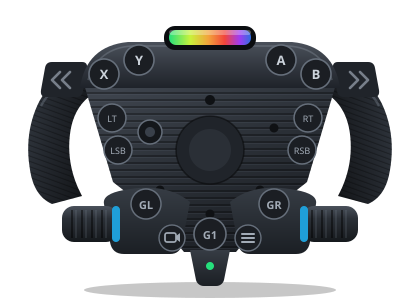

# Button Mapping

The physical controls on the RS50 / G PRO wheel and hub, and the joystick button
index each one reports. Buttons use sequential indices matching Windows
DirectInput, so bindings stay consistent across platforms.

This is the reference for binding controls in a game. The wire-level bitmask
(which report bit encodes which button) is in
[PROTOCOL_SPECIFICATION.md](PROTOCOL_SPECIFICATION.md). The G923 has its own
table below: it reports its own classic button layout straight from its HID
descriptor, not the RS50/G PRO one.

The **Index** column is the joystick button number games show when binding
(sequential, matching Windows DirectInput). The drawing above labels each
control directly, so there is no separate diagram numbering to cross-
reference any more.

| Index | Button |
|-------|--------|
| 0 | A |
| 1 | X |
| 2 | B |
| 3 | Y |
| 4 | Right Paddle / Gear Right |
| 5 | Left Paddle / Gear Left |
| 6 | RT (Right Trigger) |
| 7 | LT (Left Trigger) |
| 8 | Camera / View |
| 9 | Menu |
| 10 | RSB (Right Stick) |
| 11 | LSB (Left Stick) |
| 21 | Right Encoder CW |
| 22 | Right Encoder CCW |
| 23 | Right Encoder Push |
| 24 | Left Encoder CW |
| 25 | Left Encoder CCW |
| 26 | Left Encoder Push |
| 27 | G1 (Logitech logo) |
| 28 | GL |
| 29 | GR |

GL and GR are their own buttons, not aliases of the shifter paddles
(hardware-verified 2026-07-20 by guided capture: evdev 0x2cc / 0x2cd,
sequential after G1).

The D-pad reports as a hat switch (`ABS_HAT0X` / `ABS_HAT0Y`), not as four
buttons - diagram callout "D".

Indices 12 to 20 are gaps in the HID descriptor (unused).

## G923

The G923's own button layout, hardware-captured 2026-07-27 by a guided live
capture (every physical button pressed in turn, its joystick index
recorded) on a PS-edition unit (PID 0xc266). It reports the same sequential
DirectInput indexing as the RS50/G PRO above, but a different set of
buttons: no G1/GL/GR, and only one dial (right hand; the G923 has no left
encoder at all).

| Index | Button |
|-------|--------|
| 0 | X |
| 1 | Square |
| 2 | Circle |
| 3 | Triangle |
| 4 | Right Paddle |
| 5 | Left Paddle |
| 6 | R2 |
| 7 | L2 |
| 8 | Share |
| 9 | Options |
| 10 | R3 |
| 11 | L3 |
| 19 | Plus (Up) |
| 20 | Minus (Down) |
| 21 | Dial CW |
| 22 | Dial CCW |
| 23 | Dial Push |
| 24 | PS |

Indices 12 to 18 are gaps in the HID descriptor (unused). Indices 19-20
(Plus/Minus) are real buttons on the G923, unlike the RS50/G PRO, which
have no buttons there at all.

The D-pad reports as a hat switch (`ABS_HAT0X` / `ABS_HAT0Y`), not as four
buttons, same as the RS50/G PRO.
